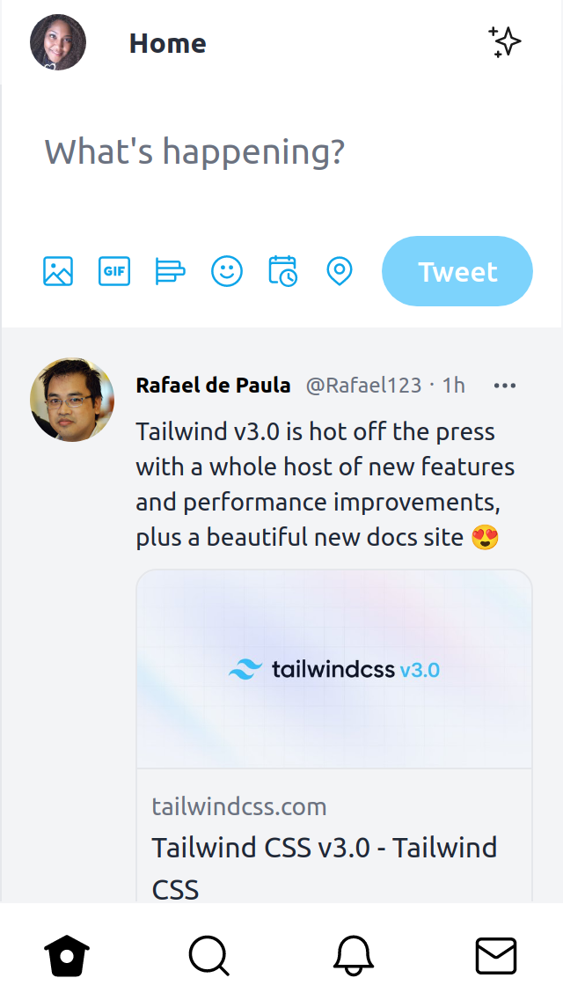
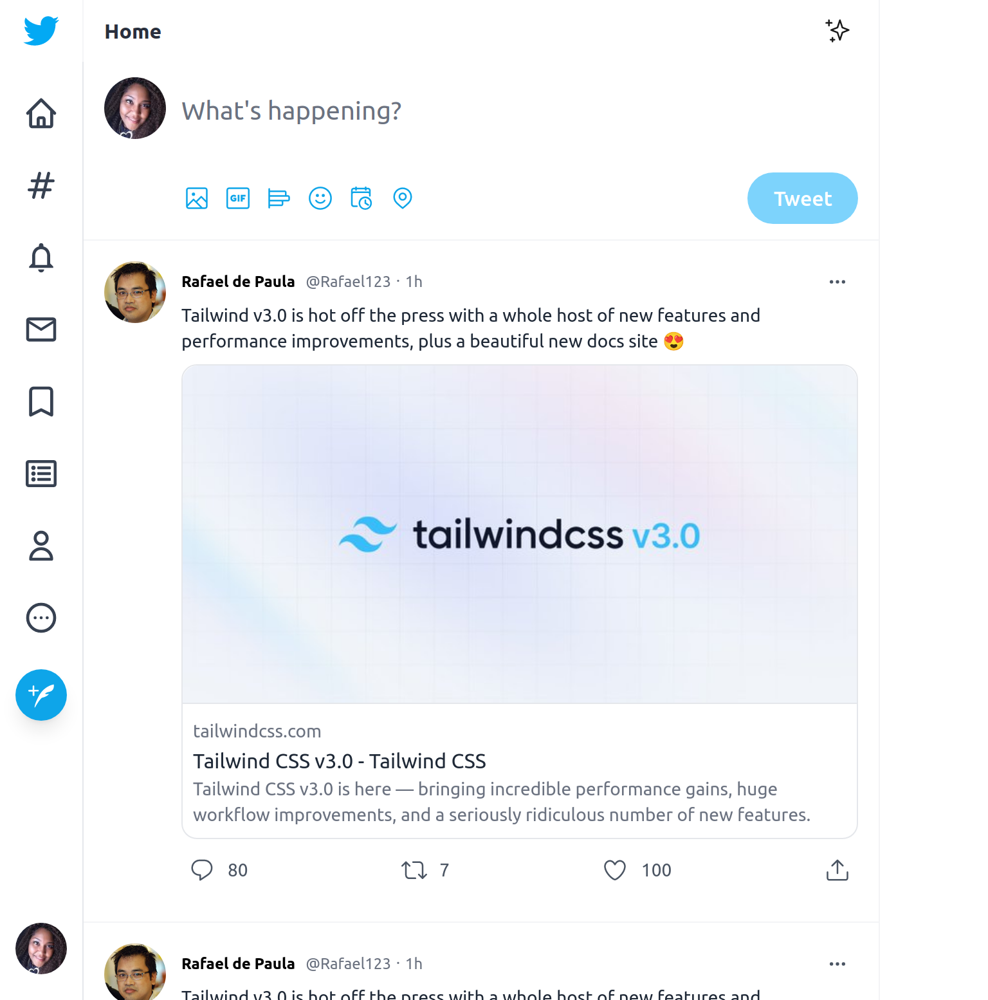
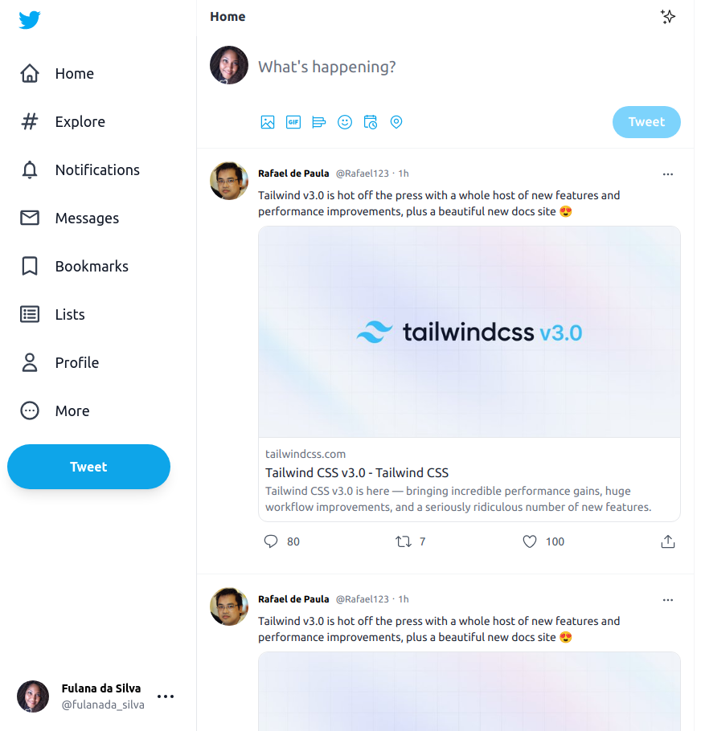

  <h3 align="center">INTERFACE TWITTER</h3>

  
Este projeto foi criado utilizando <strong>ReactJS</strong> e <strong>Tailwind</strong>.

  

    Implementei uma <strong>Interface</strong> semelhante a do <strong>Twitter</strong>, aplicando responsividade!

<h2 align="center"> Screenshoots </h2>

<h4 style="padding: 16px; text-align: center"> Mobile | Tablet </h4>

 

    
    
 

 
 
 

<h4 style="text-align:center"> Desktop </h4>

  

